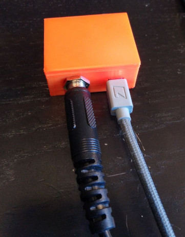
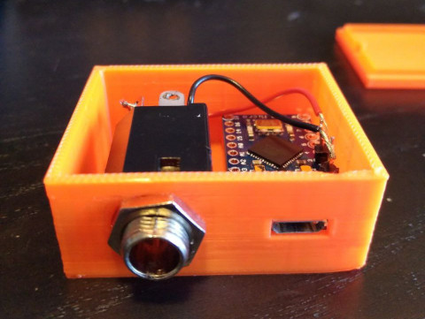
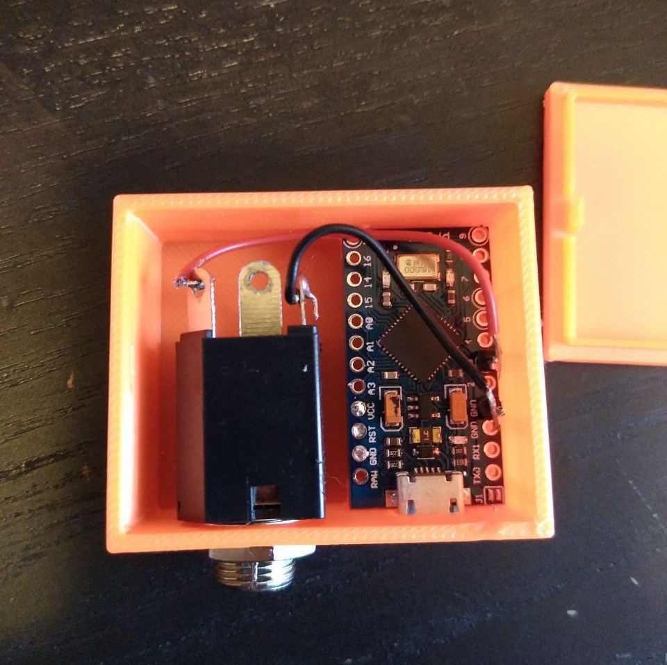

# MIDI Footswitch Converter

<a href="./img/midi-2.jpg"></a>
<a href="./img/midi-1.jpg"></a>

## Description
The goal of this project is to build a device that converts a simple analog on/off signal to a MIDI message. A [simple footswitch](https://archive.is/ykACL/2fbe0dc294888a247c4ef17947f29507e65076bb.jpg) or sustain pedal can be plugged into it and trigger the MIDI message over USB.

This code makes use of the Arduino library [MIDIUSB](https://github.com/arduino-libraries/MIDIUSB).

### Features
- Acts as a native USB MIDI device
- MIDI channel, CC number and on/off values can be configured
- Mode switch for use as a momentary switch available
- Output values can be inverted

See the section [Configuration](#configuration) for all supported settings.

## Building it
### Hardware needed
- 1x arduino board with native USB port functionality (Zero, Due, 101, Micro, Leonardo)
  - (I used a Sparkfun Pro Micro clone)
- 1x mono or stereo 1/4inch input jack
- 1x simple footswitch or sustain pedal

### Wiring
Connect sleeve to ground and the tip to a pin with digital input capability. Be aware to not use a shunt contact if one is present on your jack.

<a href="./img/midi-3.jpg"></a>

### Enclosure
[STLs](/stl/) /
[Printables](https://www.printables.com/model/449993-enclosure-for-pro-micro-quarter-inch-jack) / [Thingiverse](https://www.thingiverse.com/thing:5964743)
> Remixed from “Enclosure for DIY Ambilight with Arduino Pro Micro controller” by Florian J. aka ShreddedABS: https://www.thingiverse.com/thing:4660540

Currently this is just a rough prototype, but it works ;) (I'm currently trying to learn CAD; I may update the models in in the future)

## Configuration
The device configuration is hard-coded. At the top of the sketch, you can find this configuration block: 
```cpp
////////// Configuration ///////////
const bool MOMENTARY     = false; // Act as a momentary switch (true) or push button (false)
const bool INVERT        = false; // Inverts output values
                                  //
const byte MIDI_CHANNEL  = 0;     // MIDI channel 1-16, zero based
const byte MIDI_CC       = 64;    // MIDI CC number. 4 = Foot Controller; 64 = Sustain Pedal; https://www.midi.org/specifications-old/item/table-3-control-change-messages-data-bytes-2
const byte MIDI_MIN      = 0;     // MIDI value for state 'off' (0-127)
const byte MIDI_MAX      = 127;   // MIDI value for state 'on' (0-127)
                                  //
const int  INPUT_PIN     = 3;     // Pin number the jack tip is connected to
const int  DEBOUNCE_MS   = 30;    // Threshold for when to allow the next trigger, in milliseconds
////////////////////////////////////
```

## Roadmap
- [x] Basic plug & play MIDI IO POC works
- [x] Reading from digital input
  - [x] Fix Debouncing
  - [x] Configuration as momentary switch vs push button 
- [x] Clean up the code
  - [x] Changing channel, CC number, etc should be easy to customize
- [x] Prototype a 3D printable case

### Possible future plans
At this point I consider the prototype as finished as I imagined it in the beginning. It does what I wanted and it seems to works reliably. I will now enter a testing phase and see what I want to improve in the future. I gathered some ideas below.

- [ ] Use a stereo input jack for dual buttons
  - [ ] Bonus points for keeping the code compatible with mono jacks as well
- [ ] Design a *nice* 3D printable case
- [ ] Add schematics to this repo

## License
This document, the [photos](./img/) and [the source code](./midi_footswitch_converter.ino) is licensed under the [GPL v3](./LICENSE). The STL files are licensed under [CC BY 4.0](https://creativecommons.org/licenses/by/4.0/).